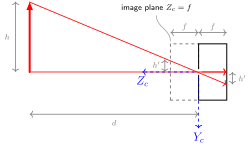
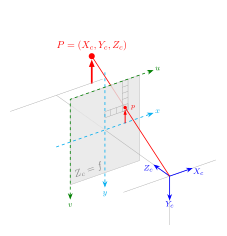
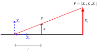

## pinhole notes

**All graphics are from https://thomasfermi.github.io/Algorithms-for-Automated-Driving/LaneDetection/CameraBasics.html**

image sensor is distance f behind pinhole. the image plane is distance f in front of pinhole.

size h of an object can be related to h' via similar triangles:

h'/h = f/d

d is distance of the object from the camera.

this means an object gets smaller as its distance to the camera (d) increases.



You can find x,y coordinates of a point.

remember f = Zc

just look at this: https://thomasfermi.github.io/Algorithms-for-Automated-Driving/LaneDetection/CameraBasics.html#equation-eq-hprime-over-h



notice how u,v start from the sides of the image plane and x,y are at the center



the equation for finding x is:

x/f = Xc/Zc (Xc and Zc is real world position)

so x = f\*(Xc/Zc)

if you want to establish which pixel coordinates (u, v) correspond to x,y, first look at the principle point (x=0, y=0) or (w//2, h//2)

x and y are measured in meters. you need to know the width and height of one sensor pixel in the image plane measured in meters.

if ku is pixel width (meters) and kv is pixel height

u = u0 + (1/ku)\*x

orb-slam

orb slam needs to provide bundle adjustment with

- orb tracking
- no redundency
- good config with keyframes and points
- initial estimation of keyframe posts and point locations
- local map to achieve scalability
- ability to detect loops

orb slam

- uses same features for tracking and mapping
- real time operation
- loop closing
- camera relocation
- essential matrix or homography
- lots of spawning, little culling

how to

- track known features and use inverse depth parameterization

homogeneos coordinates

- for any non zero number, the triple (xZ, yZ, Z) is homogeneous coordinates
  (1, 2) can be represented by (1, 2, 1) or (2, 4, 2)
- homogenous coordinates are ratios, if the third is 1 then the coords are cartesian

```
  @misc{ enwiki:1082498948,
    author = "{Wikipedia contributors}",
    title = "Homogeneous coordinates --- {Wikipedia}{,} The Free Encyclopedia",
    year = "2022",
    url = "https://en.wikipedia.org/w/index.php?title=Homogeneous_coordinates&oldid=1082498948",
    note = "[Online; accessed 1-May-2022]"
  }
```

- extract orb
- three threads which run in parallel
  - tracking

Tracking

- in charge of localizing (finding features with) a camera with every frame, and deciding when to insert a new keyframe
- performs a feature matching with previous frame, and optimize using motion only BA (bundle adjustment)

- bundle adjustment is the process of reducing the reprojection error between the expected and the predicted points

  - local mapping

Local Mapping

- if tracking is lost, place regognition model is used to perform a relocation
- mapping out those points in a space

  - loop closing

Loop Closing

- checking if the loop has been closed, as to not update those points

1. get features
2. detect camera prose
3. local visibility map - retrieved using covisibility graph

slam

- 3 threads
- localization gets new keyframe once both mapping and segmentation models are done
  - provides camera features as well as pose
  - generates new 3d points by triangulating corner features and connected corner features
- estimates ground plane using road labeled 3d points
- then estimates a correct scale of camera poses and 3d points using estimated ground plane

- mapping provides scale corrected camera poses and 3d points, segmentation performs deep learning based segmentation to a downsampled keyframe (orb) and refines the corner features by removing objects and low parallax areas using segmentation result.

localization -> keyframe data -> mapping + segmentation -> refine corner features -> update

(\*)^(i) = ith keyframe index (i) indicates the current keyframe time point
k(i) is the ith keyframe
f(i) is orb feature corner taken from k(i)
P(i) is a 3x4 normalized camera pose matrix of k(i)
normalized matrix = P triangle [R, t] R and t are a 3d rotation matrix and translation vector. Calculated by the localization model
camera center coordinate = -R^-1 \* t where (\*)^-1 is the inverse of a matrix.
C(i) = a set of indicies for connected keyframes with the ith keyframe. If two keyframes have 3d points over 15 equal coordinates, the y are connected.

C(i) = {i - 1 ..., i -C(i)}

Segmentation to only keyframes

Mapping process uses only keyframes
Mapping and segmentation are done in two different threads
two keyframes have matched features, so segmenting one will save on cost

Mapping
first generate a 3d point map x(i) by triangulation between current corner features f(i), and each of the refined corner features using a camera matrix P(i) and each of the connected camera matrices

```
@misc{https://doi.org/10.48550/arxiv.2105.00114,
  doi = {10.48550/ARXIV.2105.00114},

  url = {https://arxiv.org/abs/2105.00114},

  author = {Lee, Jinkyu and Back, Muhyun and Hwang, Sung Soo and Chun, Il Yong},

  keywords = {Computer Vision and Pattern Recognition (cs.CV), FOS: Computer and information sciences, FOS: Computer and information sciences},

  title = {Improved Real-Time Monocular SLAM Using Semantic Segmentation on Selective Frames},

  publisher = {arXiv},

  year = {2021},

  copyright = {arXiv.org perpetual, non-exclusive license}
}
```
